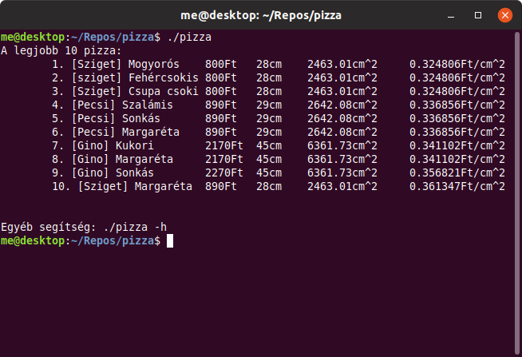

# 🍕 Pizza



## Important note

Please see [pizza-scraper](https://github.com/krook1024/pizza-scraper). It's used to
download `pizza.txt`. There's no need to manually add all pizzas.

## 🍕 Compile

```
mkdir build && cd build
cmake ..
make
```

